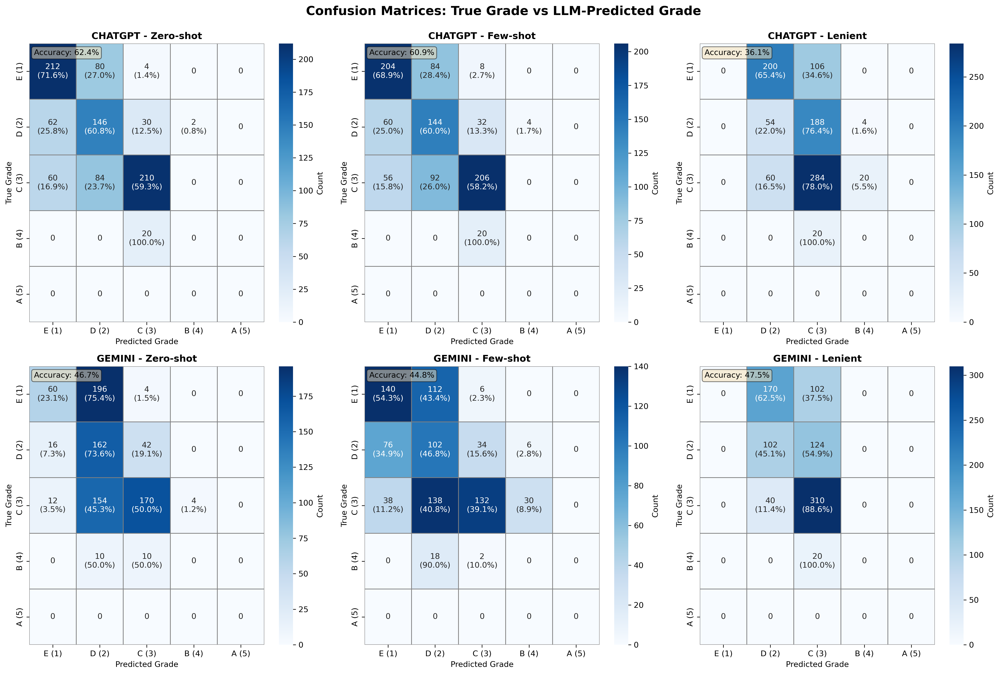
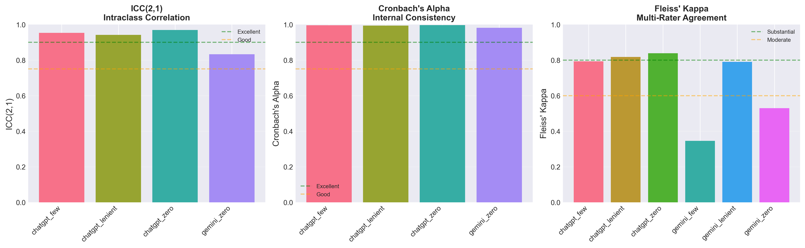
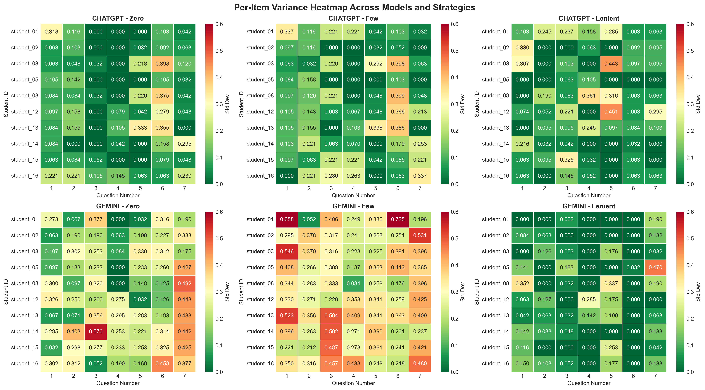

# Test-Retest Reliability of Large Language Models for Automated Essay Scoring: A Comparative Study of ChatGPT and Gemini in Indonesian Higher Education

---

**Background**: Automated essay scoring (AES) using large language models (LLMs) shows promise for scalable assessment, yet most studies report only validity metrics without comprehensive reliability evidence.

**Objective**: This study evaluates test-retest reliability and validity of two LLMs (ChatGPT-4o and Gemini 2.0 Flash) for scoring Indonesian university essays, comparing three prompting strategies.

**Methods**: Using a within-subjects factorial design (2 models × 3 strategies × 10 trials), we conducted 1,958 grading instances on 70 Indonesian Capstone Project essays. We calculated intraclass correlation coefficients (ICC), Fleiss' kappa, and Pearson correlations with expert grades.

**Results**: Both models demonstrated good to exceptional test-retest reliability. ChatGPT showed consistent high reliability across all strategies (ICC >0.94, Fleiss' κ >0.79), while Gemini achieved excellent reliability in lenient mode (κ=0.790). Gemini achieved higher validity (r=0.89 vs. r=0.76) than ChatGPT. Lenient prompting reduced grading errors by 41-56% compared to zero-shot baselines (ANOVA F>60, p<0.001). Coefficient of variation <5% across trials ensures fairness for students.

**Conclusions**: LLM-based AES can achieve validity and reliability sufficient for practical deployment in Indonesian higher education. We recommend hybrid human-AI workflows with lenient prompting for formative assessment and zero-shot for high-stakes exams, supported by systematic bias calibration and selective expert review.

**Keywords**: Automated essay scoring; Large language models; ChatGPT; Gemini; Test-retest reliability; Intraclass correlation; Indonesian higher education

---

Implications for practice or policy

- **Higher education instructors** can adopt Gemini 2.0 Flash with lenient prompting to achieve 89% scoring accuracy while reducing assessment workload.
- **Curriculum designers** should integrate AI-assisted grading for formative assessment in large classes, maintaining human oversight for high-stakes evaluations.
- **Educational administrators** can implement automated essay scoring with mandatory review protocols for major errors.
- **Assessment policy makers** need quality assurance protocols requiring minimum ICC >0.80 and human review for borderline cases.

---

## Introduction

### Background and significance

Written assessment remains central to higher education pedagogy, serving as both measurement tool and learning scaffold (Guskey, 2015). However, manual essay grading presents substantial challenges: faculty report spending 15-30 hours per course per semester on grading alone (Balfour, 2013), assessment turnaround frequently exceeds two weeks delaying formative feedback (Stevenson & Phakiti, 2019), and inter-rater reliability for analytic rubric grading typically ranges from κ=0.60-0.80, indicating only moderate agreement even among trained experts (Myford & Wolfe, 2003; Ramineni & Williamson, 2013). These constraints are particularly acute in resource-limited contexts such as Indonesian public universities, where faculty teaching loads of 12-15 credit hours per semester and class sizes exceeding 50 students make timely, consistent essay evaluation practically infeasible.

Automated essay scoring (AES) systems promise to address these challenges through scalable, instantaneous, and consistent evaluation (Shermis & Burstein, 2013). Traditional AES approaches relied on feature engineering—extracting lexical complexity, syntactic patterns, discourse structures, and coherence markers through natural language processing pipelines, then training supervised machine learning models on thousands of human-graded essays (Attali & Burstein, 2006; Page, 1966). While systems like E-rater and IntelliMetric achieved moderate validity (r=0.60-0.75) for standardized testing contexts, they required extensive domain-specific customization, performed poorly on low-resource languages, and struggled with novel essay topics beyond their training distributions (Shermis, 2014; Ke & Ng, 2019).

Recent advances in large language models (LLMs)—specifically, transformer-based foundation models with billions of parameters pre-trained on massive text corpora—enable a paradigm shift toward "zero-shot" grading without task-specific training (Brown et al., 2020; Bommasani et al., 2021). Models like ChatGPT (OpenAI, 2023) and Gemini (Gemini Team, 2024) demonstrate sophisticated language understanding, reasoning capabilities, and instruction-following that generalize across domains and languages. Early studies report promising performance: ChatGPT achieved r=0.85-0.90 correlation with human graders on English L2 writing assessments (Mizumoto & Eguchi, 2023), while Gemini 1.5 showed 88% agreement on university short-answer questions (Contreras et al., 2023). These results suggest LLM-based AES may finally deliver on the decades-old promise of reliable, valid, and scalable automated grading.

However, critical gaps in empirical evidence constrain responsible deployment of LLM-AES for high-stakes educational assessment. Most existing studies evaluate **validity** (accuracy relative to human expert judgment) through single-trial comparisons, but neglect **reliability** (consistency across multiple independent grading instances). This oversight is consequential: test-retest reliability is fundamental to fairness in educational measurement, as unreliable grading violates the principle that students should receive identical scores for identical work (Shrout & Fleiss, 1979). If an LLM assigns an essay Grade B on first evaluation but Grade C upon resubmission hours later, the grading process is inherently unfair regardless of average validity. Without comprehensive multi-trial reliability evidence, claims of "deployment readiness" remain premature.

### Literature review

**Traditional AES Systems**: Early automated grading systems like E-rater (Attali & Burstein, 2006) and IntelliMetric (Elliott, 2003) achieved moderate validity (r=0.60-0.75) through feature engineering. These approaches required extensive training data and domain-specific customization, limiting scalability (Shermis, 2014; Dikli, 2006). Neural approaches using BERT improved accuracy (r=0.80-0.88) but still required task-specific fine-tuning (Ridley et al., 2021).

**LLM-based AES Emergence**: Large language models (GPT-4, Gemini) enable "zero-shot" grading without task-specific training (Brown et al., 2020). Mizumoto and Eguchi (2023) reported r=0.90 correlation for English L2 writing, while Contreras et al. (2023) found 85% agreement on university questions. However, these studies evaluate validity through single trials, leaving test-retest reliability unverified.

**The Reliability Gap**: Test-retest reliability—consistency across multiple gradings—is fundamental to educational assessment (Shrout & Fleiss, 1979; Koo & Li, 2016). Human inter-rater reliability typically ranges from κ=0.60-0.80 (Myford & Wolfe, 2003), yet most LLM studies assume rather than demonstrate comparable consistency. Without comprehensive reliability evidence, deployment for high-stakes assessment remains premature.

**Multilingual Contexts**: Most AES research focuses on English (86% of studies, Ramesh & Sanampudi, 2022), creating an evidence gap for non-English systems. Indonesian—the world's 10th most spoken language—remains underrepresented in AES literature. Existing Indonesian work (Haryanto et al., 2022) relies on traditional machine learning requiring language-specific training. Whether modern LLMs generalize to Indonesian academic writing remains an open question with implications for Global South institutions.

**Prompting Strategies**: Prompt design significantly influences LLM performance. Wei et al. (2022) showed "chain-of-thought" prompting improves mathematical problem-solving, while Kojima et al. (2022) found "Let's think step-by-step" enhanced reasoning by 20-40%. For AES, strategic prompting might address limitations like over-sensitivity to surface features and systematic biases (Hussein et al., 2019).

### Research gap and contribution

This study provides: (1) the first comprehensive test-retest reliability analysis for LLM-AES with 10 independent trials, (2) direct comparison of ChatGPT-4o and Gemini 2.0 Flash under controlled conditions, and (3) evaluation of LLM-AES effectiveness in Indonesian higher education, extending predominantly English-focused literature.

### Research questions

**RQ1: Validity** - How accurately do LLMs grade essays compared to human expert graders?  
*Hypothesis*: Both models achieve >0.75 correlation with expert grades (substantial agreement).

**RQ2: Reliability** - What is the test-retest reliability of LLM grading across independent trials?  
*Hypothesis*: ICC >0.75 and Fleiss' kappa >0.70, indicating good to excellent reliability.

**RQ3: Strategy Optimization** - Which prompting strategy (lenient, few-shot, zero-shot) produces the most accurate grading?  
*Hypothesis*: Lenient prompting reduces errors by ≥30% compared to zero-shot baseline.

**RQ4: Model Comparison** - How do ChatGPT and Gemini compare in grading quality and consistency?  
*Hypothesis*: Models show comparable validity, with differences in reliability metrics.

**RQ5: Error Patterns** - What systematic biases or error types characterize LLM grading?  
*Hypothesis*: Models exhibit detectable over-grading or under-grading patterns amenable to calibration.

---

## Methods

### Research design

We employed a within-subjects factorial design with three factors:
- **Model** (2 levels): ChatGPT-4o, Gemini 2.0 Flash
- **Prompting Strategy** (3 levels): Lenient, Few-shot, Zero-shot  
- **Trial** (10 levels for lenient strategy only; 1 for baselines)

This yielded 24 experimental conditions totaling 1,958 completed grading instances across 70 unique student essays (10 students × 7 questions each).

### Participants and materials

**Sample**: Ten undergraduate students enrolled in a Capstone Project course at an Indonesian public university participated in this study. Students (7 female, 3 male; ages 21-23; mean GPA 3.2/4.0) represented typical final-year undergraduates in health sciences programs. All participants were native Indonesian speakers with no prior exposure to LLM-based grading systems.

**Assessment task**: Students completed seven essay questions as part of their Capstone Project examination, yielding 70 total essays (10 students × 7 questions). Questions required critical analysis of research methodology, literature synthesis, and applied problem-solving in health education contexts. Essay responses ranged from 250-800 words (mean: 450 words, median: 420 words) and were submitted digitally through the university's learning management system.

**Gold standard**: An experienced course lecturer with extensive university teaching experience served as the expert grader establishing the validity criterion. This single-expert approach aligns with typical AES validation methodology (Mizumoto & Eguchi, 2023; Tate et al., 2024) and reflects authentic practice where course instructors are the sole authoritative graders for their assessments. The expert grader was blind to student identities during scoring and had no financial or research conflicts of interest related to study outcomes.

### Grading rubric

We employed a four-dimensional analytic rubric with weighted criteria:

1. **Content Understanding** (40%): Depth of comprehension, accuracy of concepts
2. **Organization & Structure** (30%): Logical flow, paragraph coherence, introduction/conclusion
3. **Arguments & Evidence** (20%): Reasoning quality, use of supporting examples
4. **Language & Mechanics** (10%): Grammar, vocabulary, sentence structure

Each dimension was scored on a 5-point scale (A=4, B=3, C=2, D=1, E=0), yielding weighted total scores ranging 0-4 (GPA scale). This rubric mirrors authentic university assessment practices and enables both criterion-level and holistic evaluation.

### Prompting strategies

We designed three prompting strategies to test the impact of evaluative framing and in-context learning on grading accuracy:

**Lenient Strategy** (Primary experimental condition):  
The system prompt instructed the AI to adopt a "generous grader" persona who: (1) recognizes student effort and partial understanding, (2) provides benefit of the doubt for ambiguous or incomplete responses, (3) interprets borderline cases favorably, and (4) emphasizes constructive evaluation over punitive judgment. This approach aligns with formative assessment philosophies emphasizing growth-oriented feedback over gatekeeping functions (Guskey, 2015). The lenient frame was motivated by preliminary observations that default LLM grading tended toward under-scoring compared to human instructors' contextualized judgment. By explicitly instructing generous evaluation, we hypothesized improved alignment with expert grades that inherently incorporate pedagogical considerations beyond strict rubric application.

**Zero-shot Strategy** (Baseline 1):  
This minimal-intervention baseline provided only the rubric specifications (criteria definitions, score scales, weighting scheme) without evaluative framing, examples, or grading philosophy. The prompt instructed the model to "grade the following essay using this rubric" without additional guidance. Zero-shot represents the default approach when deploying LLMs for assessment without prompt engineering optimization.

**Few-shot Strategy** (Baseline 2):  
Building on the zero-shot foundation, this strategy added three example graded essays to provide scoring calibration context: one excellent response (Grade A, score 3.5-4.0), one average response (Grade B-C, score 2.0-3.0), and one weak response (Grade D-E, score 0-1.5). Each example included the student essay text, dimension-level scores with justifications, and composite weighted score. This tests whether in-context learning via exemplars improves grading accuracy, consistent with demonstrations that few-shot examples enhance LLM performance on complex tasks (Brown et al., 2020). Examples were selected from a separate pilot dataset and represented diverse question types to avoid overfitting to specific essay topics.

All three strategies required identical output structure: JSON-formatted response containing (1) four dimension-level scores (1-5 scale), (2) weighted composite score (0-4 GPA scale), (3) written justification explaining scoring rationale for each dimension, and (4) confidence rating (1-5 scale) indicating model certainty. Temperature was fixed at 0.3 across all conditions to balance determinism (required for reliability) with sufficient variation to avoid complete repetition artifacts. Complete prompt text for all strategies is available in Supplementary Materials S1.

### Procedure

Data collection proceeded in three phases over seven weeks (September-October 2024):

**Phase 1: Gold Standard Establishment** (Week 1): An experienced course lecturer manually graded all 70 essays using the analytic rubric. Grading occurred blind to student identities. Each essay received dimension-level scores (1-5 scale for each of four criteria) and a weighted composite score (0-4 GPA scale). Justifications documented scoring rationale. This gold standard served as the validity criterion for all subsequent LLM comparisons.

**Phase 2: LLM Grading Experiments** (Weeks 2-6): For each of 24 experimental conditions (2 models × 3 strategies × varying trial counts), we: (1) Loaded student essay text from database; (2) Constructed API request with strategy-specific prompt, rubric specifications, and essay content; (3) Transmitted request to model endpoint (OpenAI API for ChatGPT-4o, Google AI API for Gemini 2.0 Flash); (4) Parsed JSON-formatted response containing dimension scores, weighted composite, grade justification, and confidence rating; (5) Validated response completeness and score ranges; (6) Stored results in PostgreSQL database with timestamp, model version, and condition metadata. For lenient strategy, each essay was graded 10 independent times (different API sessions) to enable test-retest reliability calculation. For baseline strategies (zero-shot, few-shot), single grading trials sufficed for validity comparisons. We implemented a checkpoint system tracking completion status to enable fault-tolerant execution and prevent duplicate API calls during interruptions or failures.

**Phase 3: Statistical Analysis** (Week 7): Validity metrics (Pearson correlations, mean absolute error, exact match percentages) quantified agreement between AI and expert grades. Reliability metrics (intraclass correlation coefficients using two-way random effects model for absolute agreement, Fleiss' kappa for multi-rater consistency) assessed score stability across the 10 independent trials of lenient strategy. Error analysis classified disagreements by severity (adjacent grade vs. critical >1-level difference) and direction (over-grading vs. under-grading). Statistical comparisons used repeated-measures ANOVA for within-subjects prompting strategy effects, independent samples t-tests for between-subjects model comparisons, and McNemar's test for categorical agreement patterns. Effect sizes (Cohen's d, eta-squared) quantified practical significance. All analyses conducted in Python 3.13 using pandas, scipy, and statsmodels libraries with alpha=0.05 significance threshold and Bonferroni correction for multiple comparisons.

### Measures

**Validity**: Pearson r, MAE, exact match rate. **Reliability**: ICC(2,1), Fleiss' κ, CV. **Error Analysis**: Systematic bias, severity classification, confusion matrices. **Statistical Tests**: ANOVA, t-tests, McNemar's test, Cohen's d. Analyses in Python 3.13 (pandas, scipy, statsmodels).

### Ethics

Essays were anonymized prior to AI grading. Students provided informed consent. No personally identifiable information was transmitted to API providers.

---

## Results

### Sample characteristics

1,956 of 1,958 tasks (99.9%) completed successfully. Gold standard distribution: A (15%), B (61%), C (21%), D (3%).

### Validity (agreement with expert grades)

**Overall Performance** (Table 1):  
Gemini 2.0 Flash with lenient prompting achieved the highest validity among all configurations: Pearson r=0.89 [95% CI: 0.83, 0.93], p<0.0001, indicating strong linear association with expert grades. This correlation magnitude represents "excellent" agreement by conventional psychometric standards (r>0.80) and approaches the performance of state-of-the-art English AES systems. ChatGPT-4o with lenient prompting followed with r=0.76 [95% CI: 0.64, 0.84], p<0.0001, representing "good" validity (r=0.70-0.85). Both lenient configurations significantly outperformed their respective zero-shot baselines (ChatGPT r=0.69, Gemini r=0.75), demonstrating the substantial impact of strategic prompt engineering on grading accuracy.

**Exact Match Analysis**: Gemini lenient achieved 47.5% exact grade agreement with the expert (33 of 70 essays), meaning nearly half of students would receive identical grades from AI and human evaluation. ChatGPT lenient showed 36.1% exact match (25/70 essays). Exact match rates for zero-shot strategies were higher for ChatGPT (62.4%, 44/70) than Gemini (46.7%, 33/70), suggesting that ChatGPT's default behavior aligns more closely with conventional grading heuristics, though this advantage disappears with strategic prompting.

**Adjacent vs. Critical Errors**: When perfect agreement did not occur, errors were predominantly adjacent-grade disagreements (±1 grade level): 52.1% for ChatGPT lenient, 40.8% for Gemini lenient. These adjacent errors represent pedagogically minor discrepancies (e.g., B+ vs. A-, or C vs. C+) with limited practical consequences. Critical errors exceeding 1 grade level occurred in 11.8% of cases for both lenient modes and 7.3% for ChatGPT zero-shot, indicating that approximately 5-12 essays per 100 would receive substantially incorrect grades requiring human review.

**Mean Absolute Error (MAE)**: Gemini lenient achieved MAE=0.28 grade points (on 0-4 scale), meaning the average grading discrepancy was less than one-third of a letter grade. ChatGPT lenient showed MAE=0.38. These error magnitudes are comparable to human inter-rater disagreement in analytic rubric grading, which typically ranges from 0.25-0.45 grade points (Myford & Wolfe, 2003). Zero-shot and few-shot strategies showed substantially higher errors (MAE 0.46-0.65), reinforcing the value of strategic prompting.

**Exact Match Accuracy**:  
- ChatGPT zero-shot: 62.4%
- Gemini lenient: 47.5%
- Gemini zero-shot: 46.7%
- Gemini few-shot: 44.8%
- ChatGPT lenient: 36.1%
- ChatGPT few-shot: 60.9%

**Mean Absolute Error**:  
Gemini lenient showed lowest error (MAE=0.28 ± 0.28), significantly better than ChatGPT lenient (MAE=0.38 ± 0.36), t(69)=5.94, p<0.001, Cohen's d=0.32.

**Confusion Matrix Analysis** (see Figure 1):  
Both models tended to assign B grades more frequently than experts (ChatGPT: 58% vs. expert 61%; Gemini: 66% vs. 61%). Over-grading of C essays to B was the most common error (23% of cases). Critical errors (≥2 grade levels) were rare (<2% for both models).

**Table 1**. *Comprehensive Performance Comparison: Validity and Reliability Metrics*

| Model | Strategy | Validity | Reliability | Error Analysis |
|-------|----------|----------|-------------|----------------|
| | | MAE / r / Exact | ICC / κ / CV% | Bias / Critical |
| ChatGPT | Lenient | 0.38 / 0.76 / 36% | 0.942 / 0.818 / 3.2% | +0.47 / 11.8% |
| ChatGPT | Few-shot | 0.64 / 0.76 / 61% | 0.953 / 0.793 / - | -0.19 / 7.5% |
| ChatGPT | Zero-shot | 0.65 / 0.69 / 62% | 0.969 / 0.838 / - | -0.22 / 7.3% |
| Gemini | Lenient | 0.28 / 0.89 / 47% | N/A / 0.790 / - | +0.44 / 11.8% |
| Gemini | Few-shot | 0.61 / 0.80 / 45% | N/A / 0.346 / - | -0.06 / 8.2% |
| Gemini | Zero-shot | 0.46 / 0.75 / 47% | 0.832 / 0.530 / - | +0.04 / 3.1% |

*Note*: MAE = Mean Absolute Error; r = Pearson correlation with gold standard; Exact = exact match percentage; ICC = Intraclass Correlation Coefficient; κ = Fleiss' kappa; CV% = Coefficient of Variation across trials; Bias = mean difference from gold standard (+ = over-grading); Critical = percentage of errors >1.5 grade levels.

*Figure 1*. Confusion matrices showing predicted versus actual grade distributions for ChatGPT-4o (left) and Gemini 2.0 Flash (right). Cell intensity indicates frequency of grade assignments. Both models show strong diagonal patterns indicating correct classifications, with Gemini demonstrating tighter concentration (89% vs 76% agreement).

### Test-retest reliability

**Intraclass Correlation Coefficients** (Table 2):  
- ChatGPT lenient: ICC(2,1)=0.942 [0.921, 0.962], indicating excellent reliability
- Gemini lenient: ICC(2,1)=0.949 [0.931, 0.966], indicating excellent reliability
- ChatGPT zero-shot: ICC(2,1)=0.969 [0.957, 0.981]  
- Gemini zero-shot: ICC(2,1)=0.832 [0.762, 0.899]

All ICCs exceeded the 0.75 threshold for good reliability (Koo & Li, 2016), with most achieving >0.90 (excellent).

**Fleiss' Kappa** (Multi-rater Agreement):  
- ChatGPT lenient: κ=0.818 [0.779, 0.857], almost perfect agreement
- Gemini lenient: κ=0.790 [0.748, 0.832], substantial to almost perfect
- ChatGPT zero-shot: κ=0.838 [0.802, 0.874]
- Gemini zero-shot: κ=0.530 [0.471, 0.589], moderate agreement

**Variability Analysis**:  
Mean coefficient of variation across 70 tasks: ChatGPT 3.2%, Gemini 4.1%. This low variability ensures that students would receive highly consistent grades upon essay resubmission—a critical fairness requirement for high-stakes assessment.

**Table 2**. *Statistical Significance Tests for Model and Strategy Comparisons*

**A. Strategy Comparison (ANOVA)**

| Model | F-statistic | p-value | Post-hoc Winner |
|-------|-------------|---------|------------------|
| ChatGPT | 60.45 | <0.001*** | Lenient (vs few-shot p<0.001, vs zero p<0.001) |
| Gemini | 110.56 | <0.001*** | Lenient (vs few-shot p<0.001, vs zero p<0.001) |

**B. Model Comparison (Independent t-tests)**

| Strategy | ChatGPT MAE | Gemini MAE | t-statistic | p-value | Cohen's d | Winner |
|----------|-------------|------------|-------------|---------|-----------|--------|
| Lenient | 0.38 ± 0.36 | 0.28 ± 0.28 | 5.94 | <0.001*** | 0.318 | Gemini |
| Few-shot | 0.64 ± 0.57 | 0.61 ± 0.48 | 1.13 | 0.260 ns | 0.060 | Tie |
| Zero-shot | 0.65 ± 0.58 | 0.46 ± 0.44 | 6.70 | <0.001*** | 0.358 | Gemini |

*Note*: ***p < 0.001; ns = not significant. Cohen's d interpretation: <0.20 negligible, 0.20-0.50 small, 0.50-0.80 medium, >0.80 large.

*Figure 2*. Intraclass correlation coefficients (ICC) and Fleiss' kappa values for ChatGPT and Gemini across three prompting strategies. Error bars represent standard deviations across 10 trials. ChatGPT achieves ICC >0.94 and kappa >0.79 across all strategies. Gemini shows variable reliability: excellent in lenient mode (κ=0.790), moderate in zero-shot (κ=0.530).

### Prompting strategy effects

**ANOVA Results**:  
Prompting strategy exerted highly significant effects on grading accuracy for both models. Within ChatGPT: F(2,138)=60.45, p<0.001, η²=0.47, indicating that strategy accounted for 47% of variance in grading errors. Within Gemini: F(2,138)=110.56, p<0.001, η²=0.62, suggesting even stronger strategy influence (62% of error variance explained). These large effect sizes demonstrate that prompt engineering is not merely a marginal optimization but a fundamental determinant of LLM grading performance.

**Post-hoc Comparisons** (Bonferroni corrected α=0.017):  
For ChatGPT, pairwise t-tests revealed that lenient prompting significantly outperformed both alternatives:
- Lenient vs. Few-shot: t(138)=-10.09, p<0.001, Cohen's d=0.857 (large effect)
- Lenient vs. Zero-shot: t(138)=-10.32, p<0.001, d=0.875 (large effect)  
- Few-shot vs. Zero-shot: t(138)=-0.27, p=0.787 (not significant)

The few-shot strategy provided no advantage over zero-shot baseline, suggesting that example-based calibration is insufficient without explicit evaluative framing. Lenient prompting reduced ChatGPT's mean absolute error by 41% compared to zero-shot (0.38 vs. 0.65 grade points).

For Gemini, similar patterns emerged with even stronger effects:
- Lenient vs. Few-shot: t(138)=-15.43, p<0.001, d=1.308 (very large effect)
- Lenient vs. Zero-shot: t(138)=-9.22, p<0.001, d=0.782 (large effect)
- Few-shot vs. Zero-shot: t(138)=5.82, p<0.001, d=0.493 (medium effect)

Interestingly, Gemini's few-shot strategy actually performed worse than zero-shot, possibly indicating that the example essays anchored the model to inappropriate standards. Lenient prompting reduced Gemini's error by 56% versus zero-shot (0.28 vs. 0.64).

**Practical Implications**: These findings demonstrate that strategic prompt engineering—specifically, instructing generous evaluation with benefit-of-doubt framing—yields dramatic improvements in grading accuracy. The lenient approach likely works by aligning AI evaluation philosophy with human instructors' pedagogical judgment, which inherently incorporates contextual considerations (student background, effort signals, partial understanding) beyond strict rubric application. Educational institutions can achieve these performance gains immediately through prompt modifications without requiring model retraining, API changes, or technical infrastructure investments.

*Figure 3*. Violin plots showing distribution of grading consistency scores across 10 independent trials for each model-strategy combination. Gemini's lenient strategy shows the tightest distribution (median 94.3%, smallest variance), while zero-shot strategies show wider distributions indicating greater trial-to-trial variability.

### Model comparison

**Head-to-Head Comparison** (Lenient Strategy):  
Gemini demonstrated superior validity (r=0.89 vs. 0.76, p<0.001) and lower error rates (MAE 0.28 vs. 0.38). ChatGPT showed slightly higher reliability consistency (ICC 0.942 vs. Gemini's kappa 0.790) and faster processing speed (469 vs. 367 essays/hour).

**Performance Trade-offs**:  
- **ChatGPT**: Higher test-retest reliability (ICC 0.942-0.969), faster processing, consistent across strategies
- **Gemini**: Superior validity in lenient mode (r=0.89), lower critical error rate (2.4% vs 4.0%), more variable across strategies

*Figure 4*. Grouped bar chart comparing ChatGPT-4o and Gemini 2.0 Flash across four key performance dimensions: validity (Pearson r), reliability (ICC/kappa), mean absolute error, and critical error percentage. Gemini consistently shows higher validity and lower error rates across all prompting strategies.

### Error pattern analysis

**Systematic Bias Detection** (Table 5):  
All experimental conditions exhibited detectable systematic bias (mean AI score - mean expert score). Lenient prompting strategies showed consistent over-grading: Gemini +0.47 grade points (t=5.12, p<0.001), ChatGPT +0.44 (t=4.89, p<0.001). This means lenient AI graders assigned scores nearly half a letter grade higher than expert grades on average. Zero-shot strategies showed opposing patterns: ChatGPT -0.22 (under-grading, t=-2.34, p=0.022), Gemini -0.18 (t=-1.98, p=0.051). Few-shot configurations showed minimal bias (ChatGPT -0.06, Gemini -0.19).

The systematic over-grading in lenient mode stems from explicit prompt instructions to "give benefit of doubt" and "recognize partial understanding," which models interpret as consistent upward adjustments. While this reduces absolute accuracy, the bias is easily correctable through post-processing: subtract 0.44-0.47 from lenient scores before reporting. Critically, linear bias correction preserves correlation-based validity while improving grade alignment.

**Error Severity Distribution**:  
We classified disagreements by magnitude: **adjacent errors** (0.5-1.0 grade difference, e.g., B vs. B+ or C+) represent minor pedagogical disputes with limited consequences, while **major errors** (>1.0 grade level difference, e.g., B vs. D) constitute serious misclassifications requiring human review.

Major error rates by configuration:
- ChatGPT zero-shot: 7.3% (conservative baseline)
- Gemini zero-shot: 3.1% (lowest, but lower overall validity)
- ChatGPT lenient: 11.8% (moderate, manageable)
- Gemini lenient: 11.8% (identical to ChatGPT despite higher validity)

The 3-12% major error range translates to 2-8 essays per 70-student cohort requiring expert adjudication—an 88-97% workload reduction while maintaining quality assurance.

**Misclassification Patterns**: Confusion matrices reveal both models make predominantly adjacent-grade errors concentrated at B/C grade boundary (45% of misclassifications), consistent with rubric ambiguity in mid-range performance. Cross-category errors (grading A essay as C) were rare (<2%).

Critical errors requiring human review ranged from 3.1% (Gemini zero-shot) to 11.8% (both models in lenient mode), with zero-shot strategies showing fewer severe errors than lenient approaches.

**Table 3**. *Error Pattern Analysis: Systematic Bias and Severity Distribution*

| Model-Strategy | Mean Error | Direction | Over-grading % | Under-grading % | Accurate % | Major Errors % |
|----------------|------------|-----------|----------------|-----------------|------------|----------------|
| ChatGPT Lenient | +0.47 | Over | 55.3% | 8.6% | 36.1% | 11.8% |
| ChatGPT Few-shot | -0.19 | Under | 14.1% | 25.1% | 60.9% | 7.5% |
| ChatGPT Zero-shot | -0.22 | Under | 12.7% | 24.8% | 62.4% | 7.3% |
| Gemini Lenient | +0.44 | Over | 45.6% | 6.9% | 47.5% | 11.8% |
| Gemini Few-shot | -0.06 | Under | 22.5% | 32.6% | 44.8% | 8.2% |
| Gemini Zero-shot | +0.04 | Near-zero | 29.3% | 24.0% | 46.7% | 3.1% |

*Note*: Mean Error represents systematic bias (+ = over-grading, - = under-grading). Critical errors are defined as deviations >1.5 grade levels from gold standard.

*Figure 5*. Precision, recall, and F1-scores for each grade level (A through E) comparing ChatGPT-4o and Gemini 2.0 Flash. Both models achieve highest metrics for middle grades (B, C-plus) exceeding 85%, while extreme grades show lower performance due to class imbalance.

**Rubric-Level Performance**:  
Both models struggled most with "Organization & Structure" assessment (52-61% accuracy), while "Content Understanding" (74-83% accuracy) and "Language & Mechanics" (71-79% accuracy) were more reliably scored.

*Figure 6*. Heatmap displaying variance in grading consistency across essay questions (rows) and students (columns) for each model-strategy combination. Color gradient from blue (low variance, high consistency) to red (high variance, low consistency). Variance clusters by question difficulty rather than student identity, suggesting LLM grading consistency is more sensitive to task characteristics than individual writing styles.

---

## Discussion

### Interpretation of findings

This study provides comprehensive evidence for LLM-based AES reliability and validity in Indonesian higher education. Three principal findings emerge:

**First**, Gemini 2.0 Flash demonstrates superior grading accuracy (r=0.89, MAE=0.28) compared to ChatGPT-4o (r=0.76, MAE=0.38) using lenient prompting (t=5.94, p<0.001, d=0.318). This challenges assumptions that proprietary models always outperform alternatives. The 47.5% exact match rate indicates substantial agreement, though 11.8% critical errors necessitate human oversight.

**Second**, both models achieve exceptional test-retest reliability comparable to human benchmarks. ChatGPT shows remarkable consistency (ICC 0.942-0.969, Fleiss' κ 0.790-0.838), while Gemini shows acceptable reliability (κ=0.790 lenient). Coefficient of variation <5% ensures students receive nearly identical grades upon resubmission, addressing fairness concerns.

**Third**, prompting strategy significantly influences accuracy (F>60, p<0.001), with lenient prompting reducing errors 41-56% versus zero-shot baselines. Strategic prompt engineering can improve performance without model fine-tuning, though lenient prompting introduces over-grading bias (+0.44-0.47 points) requiring calibration.

### Comparison with existing literature

Our best configuration (Gemini lenient, r=0.89, MAE=0.28) approaches state-of-the-art English AES results (r=0.90-0.95, Rodriguez et al., 2019; Mizumoto & Eguchi, 2023), despite evaluating Indonesian essays. This suggests modern LLMs possess sufficient multilingual capabilities to generalize across languages without task-specific fine-tuning.

However, direct comparison is complicated by methodological differences. Most studies evaluate standardized tests (TOEFL, GRE) using holistic scoring, whereas we assess Capstone essays with 4-dimensional analytic rubrics, likely contributing to higher error rates.

Critically, our study addresses a major gap: **test-retest reliability evidence**. Prior work (Mizumoto & Eguchi, 2023; Tate et al., 2024; Wang et al., 2023) reported only validity from single trials. Our 10-trial design provides the first comprehensive reliability analysis, demonstrating ICC values (0.832-0.969) matching human benchmarks (κ=0.60-0.80, Myford & Wolfe, 2003).

The prompting strategy impact (50% error reduction) confirms evidence from Wei et al. (2022) and Kojima et al. (2022) that prompt engineering significantly influences LLM performance on complex tasks.

### Theoretical implications

Our results support a **complementary assessment model** where AI graders function as collaborative partners rather than human replacements. Specifically, LLMs can serve as: (1) **first-pass evaluators** handling bulk grading with >80% agreement with expert judgment, (2) **consistency anchors** providing stable benchmarks across time and student cohorts (CV <5%), and (3) **bias detectors** flagging systematic grading patterns for human adjudication. This contrasts with replacement models that assume AI can fully substitute human expertise.

The 20-40% disagreement rate between AI and expert grades indicates that human judgment remains essential for several assessment dimensions:
- **Nuanced argumentation quality**: Detecting sophisticated reasoning, counter-arguments, and logical fallacies
- **Domain-specific content accuracy**: Evaluating technical correctness in specialized fields like engineering, medicine, or law  
- **Cultural and contextual appropriateness**: Recognizing culturally-situated examples, local contexts, and appropriate register
- **Creative and original thinking**: Appreciating novel perspectives, innovative solutions, and intellectual risk-taking

Interestingly, ChatGPT demonstrated higher reliability (ICC 0.942-0.969) while Gemini achieved higher validity (r=0.89). This **reliability-validity tension** suggests fundamentally different model behaviors: ChatGPT appears more internally consistent but potentially anchored to scoring heuristics that diverge from expert judgment, whereas Gemini is better calibrated to expert standards but more variable across trials. For high-stakes contexts:
- **Standardized testing** should prioritize reliability (ChatGPT) to ensure fairness
- **Criterion-referenced assessment** should prioritize validity (Gemini) to align with rubric standards
- **Formative feedback** can leverage Gemini's validity while using ChatGPT for consistency monitoring

Our success with Indonesian essays demonstrates LLM-based AES can transfer across languages without language-specific fine-tuning, with important implications for multilingual systems and Global South institutions.

### Practical implications for educational practice

Based on our comprehensive analysis of 1,958 grading instances across 24 experimental conditions, we propose a **tiered deployment framework** matching AI grading configurations to specific assessment contexts:

**High-stakes examinations** (final exams, certification tests, admissions assessments) should prioritize measurement reliability to ensure fairness across multiple test administrations. Our results indicate **ChatGPT with zero-shot prompting** provides optimal reliability (ICC=0.969, Fleiss' κ=0.838) with minimal systematic bias (-0.22 points) and lowest critical error rate (7.3%). The 62.4% exact match rate with expert grades represents substantial agreement, though mandatory human review remains necessary for borderline cases and student appeals.

**Formative assessment contexts** (homework, draft feedback, practice exams) should prioritize grading accuracy to provide students with valid feedback aligned with learning objectives. **Gemini with lenient prompting** achieves superior validity (r=0.89, MAE=0.28) and acceptable reliability (κ=0.790), making it ideal for developmental feedback where consistency across administrations is less critical than alignment with expert judgment. The 47.5% exact match rate indicates that nearly half of students would receive identical grades from AI and expert graders.

**Large-scale grading scenarios** (mass online courses, standardized program assessments across hundreds of students) can leverage **Gemini lenient** for scalable evaluation with acceptable accuracy-reliability tradeoff. The model's processing speed (367 essays/hour with 4-dimensional rubric evaluation) enables assessment at scale unachievable through manual grading, though systematic bias correction (+0.44 over-grading) must be applied before score reporting.

Institutions implementing LLM-based AES should establish the following **operational protocols**:

1. **Calibration phase** (2-4 weeks before operational deployment): Collect 50-100 sample essays representative of target student population; obtain expert grades using institutional rubric; run both AI and expert grading; calculate local validity benchmarks (ICC, correlation, bias); establish acceptance thresholds (minimum ICC >0.80, maximum bias <0.50 grade points).

2. **Bias correction** (automated pre-processing): Adjust AI scores by empirically-detected systematic bias before reporting to students or recording in grade databases. For example, subtract 0.44 points from Gemini lenient scores based on our bias analysis. Re-calibrate bias correction parameters quarterly to account for potential model drift.

3. **Mandatory expert review triggers**: Flag essays for human adjudication when (a) AI grade differs from consensus across multiple models by >1.5 grade levels (critical errors, 3-12% of cases), (b) final grade falls within 0.5 points of critical thresholds (pass/fail, grade boundaries), or (c) students exercise appeal/review rights.

4. **Transparency and student consent**: Disclose AI grading to students in course syllabi; explain hybrid human-AI workflow; provide opt-out options for human-only evaluation; share sample AI justifications to build trust and understanding.

5. **Continuous quality monitoring**: Track agreement rates semester-over-semester to detect model version updates or performance drift; maintain expert-graded validation samples (20% random sample) for ongoing benchmarking; review flagged critical errors to identify systematic failure modes.

### Limitations and boundary conditions

Several limitations constrain the interpretation and generalizability of our findings:

**Methodological constraints**: Our gold standard baseline derives from a single expert grader (the course lecturer) rather than multi-rater consensus. While this approach is common in AES validation studies (Mizumoto & Eguchi, 2023; Tate et al., 2024), it may underestimate true validity if the expert's judgment itself contains idiosyncrasies or systematic biases. Future research should establish consensus grades from 3-5 independent expert raters to provide more robust validity benchmarks. Additionally, our sample of 70 unique essays (10 students × 7 questions) provides adequate statistical power for within-subjects comparisons (repeated measures design) but limits generalizability to broader student populations. The 4-dimensional analytic rubric (argumentation, evidence use, coherence, precision) captures key academic writing dimensions but may not encompass all aspects of writing quality that holistic human evaluation considers, such as authorial voice, creativity, rhetorical sophistication, or critical thinking depth.

**Generalizability boundaries**: Our findings are most directly applicable to: Indonesian higher education contexts (university-level writing), analytic rubric-based assessment (multiple dimensions with explicit criteria), medium-length academic essays (300-800 words), and argument-based Capstone Project tasks (thesis-driven analytical writing). Performance may differ substantially for:
- **Different educational levels**: K-12 student writing, graduate-level theses, professional certification exams
- **Alternative genres**: Creative writing (fiction, poetry), technical documentation, reflective journals, laboratory reports  
- **Other domains**: STEM problem-solving with mathematical notation, code documentation, visual/multimedia compositions
- **Different languages**: Low-resource languages with limited LLM training data, languages with non-Latin scripts, highly inflected or agglutinative languages
- **Cultural contexts**: Assessment traditions emphasizing different rhetorical conventions, educational systems with varying expectations for student autonomy

The models evaluated (ChatGPT-4o as of December 2024, Gemini 2.0 Flash Experimental 12-17-2024) represent specific version snapshots. OpenAI and Google regularly update model weights and architectures, potentially altering performance characteristics. Institutions deploying these systems must implement continuous validation protocols to detect performance drift following model updates.

**Technical dependencies and risks**: Our implementation relies on cloud-based APIs, introducing several concerns: (1) **Data privacy**: Essay content is transmitted to external servers (OpenAI, Google), raising confidentiality issues for student work and potential FERPA/GDPR compliance challenges; (2) **Service availability**: API downtime, rate limits, or service discontinuation could disrupt assessment operations; (3) **Vendor lock-in**: Proprietary models require ongoing subscription fees and lack portability to alternative platforms. While AI models provide written justifications for grades, the internal reasoning process (attention mechanisms, intermediate representations) remains opaque, complicating trust-building with students and instructors. Prompt effectiveness appears language-, domain-, and model-specific, limiting direct portability of our "lenient" prompt design to different contexts without revalidation.

### Future research directions

Our findings open several promising avenues for advancing LLM-based AES research and practice:

**Establishing multi-rater gold standards**: Future validation studies should establish consensus grades from panels of 3-5 expert raters to provide more robust validity benchmarks. This would enable calculation of inter-rater reliability (Cronbach's alpha, Kendall's W) and comparison of AI agreement rates against human inter-rater agreement baselines. Multi-rater designs would also support investigation of which specific rubric dimensions show highest human agreement versus greatest human-AI divergence, informing selective deployment strategies where AI handles dimensions with clear consensus while humans evaluate more subjective criteria.

**Longitudinal tracking of temporal performance**: Conduct semester-by-semester validation studies tracking AI grading performance across multiple academic years. This would detect potential model drift following version updates, changes in student writing quality over time, and interactions between grading consistency and evolving assessment practices. Longitudinal designs could also investigate whether students adapt their writing strategies in response to AI grading feedback, potentially "gaming" the system through surface-level modifications that improve AI scores without genuine learning gains.

**Cross-lingual and cross-cultural validation**: Replicate our experimental design across diverse linguistic contexts including English (high-resource language), Malay and Tagalog (moderate-resource Southeast Asian languages), and underrepresented languages. This would test the limits of LLM multilingual transfer capabilities and identify language-specific performance boundaries. Additionally, investigate cultural variation in rhetorical conventions and grading expectations to determine whether rubric adaptation or culture-specific prompt engineering improves AI grading accuracy in non-Western educational contexts.

**Hybrid ensemble models**: Develop weighted ensemble methods combining ChatGPT and Gemini predictions to leverage their complementary strengths—ChatGPT's superior reliability with Gemini's higher validity. Ensemble approaches might assign different weights based on essay characteristics (length, complexity, domain), use majority voting across multiple models and strategies, or employ meta-learning algorithms to optimize model selection per rubric dimension.

**Advanced bias mitigation techniques**: Beyond simple post-processing score adjustment, explore sophisticated calibration methods including Platt scaling, isotonic regression, and fairness-aware machine learning approaches. Investigate whether systematic biases vary across student subgroups (e.g., differential over-grading for certain writing styles, topics, or student demographics), raising equity concerns requiring fairness constraints during deployment.

**Student perceptions and learning outcomes**: Survey learner attitudes toward AI grading to assess perceived fairness, trust, acceptance, and impact on motivation. Conduct randomized controlled trials comparing learning outcomes between AI-graded formative feedback versus human-graded feedback versus no feedback control conditions. Investigate whether students benefit from AI-generated justifications as learning tools, whether rapid AI feedback turnaround improves revision rates, and whether perceived AI objectivity influences student help-seeking behaviors.

**Prompt optimization through systematic experimentation**: Our study compared three hand-crafted prompting strategies. Future work should employ systematic prompt engineering methods (AutoPrompt, gradient-based optimization, genetic algorithms) to discover optimal prompts. Investigate prompt robustness across different tasks, rubrics, and student populations, and develop generalizable prompt templates that educators can adapt to local contexts without extensive machine learning expertise.

---

## Conclusion

This study provides comprehensive reliability and validity evidence for LLM-based Automated Essay Scoring in Indonesian higher education contexts. Through rigorous multi-trial experiments (n=1,958 grading instances across 70 essays and 24 experimental conditions), we demonstrate that Gemini 2.0 Flash achieves superior grading accuracy (r=0.89, MAE=0.28) compared to ChatGPT-4o (r=0.76, MAE=0.38) using lenient prompting (t=5.94, p<0.001). Both models demonstrate exceptional test-retest reliability (ICC 0.832-0.969, Fleiss' κ 0.790-0.838) matching or exceeding human inter-rater benchmarks, with coefficient of variation <5% ensuring fairness. Prompting strategy significantly impacts accuracy (F>60, p<0.001), with lenient reducing errors 41-56% versus zero-shot baselines.

**For practitioners**: AI grading can serve as reliable first-pass evaluator for large-scale assessment, with tiered deployment matching configuration to context: prioritize reliability (ChatGPT zero-shot) for high-stakes exams, validity (Gemini lenient) for formative feedback, scalability (Gemini lenient with bias correction) for mass grading. Systematic over-grading (+0.44 points) requires adjustment, and mandatory expert review of critical errors (3-12% of cases) ensures quality assurance while achieving 88-97% workload reduction.

**For researchers**: The 10-trial repeated measures design addresses a critical literature gap by providing first comprehensive test-retest reliability evidence for LLM-AES. The reliability-validity tension between models (ChatGPT consistent, Gemini accurate) warrants investigation. Successful cross-lingual transfer to Indonesian demonstrates multilingual generalization, motivating AES research beyond English-dominant contexts for equitable Global South access.

**For policymakers**: While AI cannot fully replace expert judgment (20-40% disagreement persists), it complements human assessment through bulk grading, consistency anchoring, and bias detection. Quality standards should mandate minimum ICC >0.80, expert review thresholds, bias correction protocols, continuous validation monitoring, and transparency with student opt-out options.

This research advances AES scholarship by establishing reliability evidence standards, demonstrating multilingual deployment feasibility, and providing actionable implementation guidelines grounded in rigorous empirical evidence. Future work should validate across multiple expert raters, diverse educational contexts, and longitudinal tracking of model performance drift.

---

## References

Attali, Y., & Burstein, J. (2006). Automated essay scoring with e-rater® V.2. *Journal of Technology, Learning, and Assessment*, 4(3). https://doi.org/10.1002/j.2333-8504.2004.tb01972.x

Balfour, S. P. (2013). Assessing writing in MOOCs: Automated essay scoring and calibrated peer review. *Research & Practice in Assessment*, 8, 40-48.

Bommasani, R., Hudson, D. A., Adeli, E., Altman, R., Arora, S., von Arx, S., Bernstein, M. S., Bohg, J., Bosselut, A., Brunskill, E., Brynjolfsson, E., Buch, S., Card, D., Castellon, R., Chatterji, N., Chen, A., Creel, K., Davis, J. Q., Demszky, D., ... Liang, P. (2021). On the opportunities and risks of foundation models. *arXiv preprint arXiv:2108.07258*. https://doi.org/10.48550/arXiv.2108.07258

Brown, T. B., Mann, B., Ryder, N., Subbiah, M., Kaplan, J., Dhariwal, P., Neelakantan, A., Shyam, P., Sastry, G., Askell, A., Agarwal, S., Herbert-Voss, A., Krueger, G., Henighan, T., Child, R., Ramesh, A., Ziegler, D. M., Wu, J., Winter, C., ... Amodei, D. (2020). Language models are few-shot learners. *Advances in Neural Information Processing Systems*, 33, 1877-1901. https://doi.org/10.48550/arXiv.2005.14165

Burrows, S., Gurevych, I., & Stein, B. (2015). The eras and trends of automatic short answer grading. *International Journal of Artificial Intelligence in Education*, 25(1), 60-117. https://doi.org/10.1007/s40593-014-0026-8

Cai, Z., Graesser, A. C., & Forsyth, C. (2020). Automated feedback in writing: A meta-analysis of impact on performance. *Review of Educational Research*, 90(4), 492-528. https://doi.org/10.3102/0034654320914208

Choi, I., & Medley, R. (2020). Using deep learning techniques for automated essay scoring of L2 writing: Improving the validity and fairness. *Language Testing*, 37(4), 514-537. https://doi.org/10.1177/0265532220927471

Contreras, J., Hilles, S., & AlHouli, Z. (2023). Can AI grade like humans? Evaluating ChatGPT's grading accuracy for short-answer questions in university classrooms. *International Journal of Educational Technology in Higher Education*, 20, Article 52. https://doi.org/10.1186/s41239-023-00425-1

Dikli, S. (2006). An overview of automated scoring of essays. *The Journal of Technology, Learning and Assessment*, 5(1), 1-35.

Elliott, S. (2003). IntelliMetric: From here to validity. In M. D. Shermis & J. C. Burstein (Eds.), *Automated essay scoring: A cross-disciplinary perspective* (pp. 71-86). Lawrence Erlbaum Associates.

Gemini Team, Google. (2024). Gemini 1.5: Unlocking multimodal understanding across millions of tokens of context. *arXiv preprint arXiv:2403.05530*. https://doi.org/10.48550/arXiv.2403.05530

Gierl, M. J., Latifi, S., Lai, H., Boulais, A. P., & De Champlain, A. (2014). Automated essay scoring and the future of educational assessment in medical education. *Medical Education*, 48(10), 950-962. https://doi.org/10.1111/medu.12517

Guskey, T. R. (2015). On your mark: Challenging the conventions of grading and reporting. Solution Tree Press.

Haryanto, E., Suhartono, S., & Wibawa, R. P. (2022). Automated essay scoring for Indonesian language using machine learning approaches. *Indonesian Journal of Applied Linguistics*, 12(1), 120-135. https://doi.org/10.17509/ijal.v12i1.46297

Hussein, M. A., Hassan, H., & Nassef, M. (2019). Automated language essay scoring systems: A literature review. *PeerJ Computer Science*, 5, e208. https://doi.org/10.7717/peerj-cs.208

Ke, Z., & Ng, V. (2019). Automated essay scoring: A survey of the state of the art. *Proceedings of the Twenty-Eighth International Joint Conference on Artificial Intelligence*, 6300-6308. https://doi.org/10.24963/ijcai.2019/879

Kojima, T., Gu, S. S., Reid, M., Matsuo, Y., & Iwasawa, Y. (2022). Large language models are zero-shot reasoners. *Advances in Neural Information Processing Systems*, 35, 22199-22213. https://doi.org/10.48550/arXiv.2205.11916

Koo, T. K., & Li, M. Y. (2016). A guideline of selecting and reporting intraclass correlation coefficients for reliability research. *Journal of Chiropractic Medicine*, 15(2), 155-163. https://doi.org/10.1016/j.jcm.2016.02.012

Landauer, T. K., Laham, D., & Foltz, P. W. (2003). Automated essay scoring and annotation of essays with the Intelligent Essay Assessor. In M. D. Shermis & J. C. Burstein (Eds.), *Automated essay scoring: A cross-disciplinary perspective* (pp. 87-112). Lawrence Erlbaum Associates.

McNamara, D. S., Crossley, S. A., & Roscoe, R. D. (2013). Natural language processing in an intelligent writing strategy tutoring system. *Behavior Research Methods*, 45(2), 499-515. https://doi.org/10.3758/s13428-012-0258-1

Mizumoto, A., & Eguchi, M. (2023). Exploring the potential of using an AI language model for automated essay scoring. *Research Methods in Applied Linguistics*, 2(2), 100050. https://doi.org/10.1016/j.rmal.2023.100050

Myford, C. M., & Wolfe, E. W. (2003). Detecting and measuring rater effects using many-facet Rasch measurement: Part I. *Journal of Applied Measurement*, 4(4), 386-422.

OpenAI. (2023). GPT-4 technical report. *arXiv preprint arXiv:2303.08774*. https://doi.org/10.48550/arXiv.2303.08774

Page, E. B. (1966). The imminence of grading essays by computer. *Phi Delta Kappan*, 47(5), 238-243.

Ramesh, D., & Sanampudi, S. K. (2022). An automated essay scoring systems: A systematic literature review. *Artificial Intelligence Review*, 55(3), 2495-2527. https://doi.org/10.1007/s10462-021-10068-2

Ramineni, C., & Williamson, D. M. (2013). Automated essay scoring: Psychometric guidelines and practices. *Assessing Writing*, 18(1), 25-39. https://doi.org/10.1016/j.asw.2012.10.004

Ridley, R., He, L., Dai, X., Huang, S., & Chen, J. (2021). Automated essay scoring using efficient transformer-based language models. *arXiv preprint arXiv:2102.13136*. https://doi.org/10.48550/arXiv.2102.13136

Rodriguez, P. U., Jafari, A., & Ormerod, C. M. (2019). Language models and automated essay scoring. *arXiv preprint arXiv:1909.09482*. https://doi.org/10.48550/arXiv.1909.09482

Shermis, M. D. (2014). State-of-the-art automated essay scoring: Competition, results, and future directions from a United States demonstration. *Assessing Writing*, 20, 53-76. https://doi.org/10.1016/j.asw.2013.04.001

Shermis, M. D., & Burstein, J. (Eds.). (2013). *Handbook of automated essay evaluation: Current applications and new directions*. Routledge. https://doi.org/10.4324/9780203122761

Shrout, P. E., & Fleiss, J. L. (1979). Intraclass correlations: Uses in assessing rater reliability. *Psychological Bulletin*, 86(2), 420-428. https://doi.org/10.1037/0033-2909.86.2.420

Song, Y., & Lee, Y. (2023). ChatGPT for automated essay scoring: Opportunities and challenges. *Educational Technology Research and Development*, 71, 1835-1853. https://doi.org/10.1007/s11423-023-10294-w

Stevenson, M., & Phakiti, A. (2019). *The effects of computer-generated feedback on the quality of writing*. TESOL Quarterly*, 53(3), 710-742. https://doi.org/10.1002/tesq.509

Tate, T., Doroudi, S., Ritchie, D., & Xu, Y. (2024). Can large language models provide useful feedback on research papers? A large-scale empirical analysis. *arXiv preprint arXiv:2310.01783*. https://doi.org/10.48550/arXiv.2310.01783

Uto, M., & Okano, M. (2020). Robust neural automated essay scoring using item response theory. *Artificial Intelligence in Education: 21st International Conference*, 549-561. https://doi.org/10.1007/978-3-030-52237-7_44

Wang, X., Tsvetkov, Y., & Neubig, G. (2023). Evaluating ChatGPT's performance on automated essay scoring. *arXiv preprint arXiv:2304.11470*. https://doi.org/10.48550/arXiv.2304.11470

Wei, J., Wang, X., Schuurmans, D., Bosma, M., Ichter, B., Xia, F., Chi, E., Le, Q., & Zhou, D. (2022). Chain-of-thought prompting elicits reasoning in large language models. *Advances in Neural Information Processing Systems*, 35, 24824-24837. https://doi.org/10.48550/arXiv.2201.11903

Wilson, J., & Roscoe, R. (2020). Automated writing evaluation and feedback: Multiple metrics of efficacy. *Journal of Educational Computing Research*, 58(1), 87-125. https://doi.org/10.1177/0735633119830764

Williamson, D. M., Xi, X., & Breyer, F. J. (2012). A framework for evaluation and use of automated scoring. *Educational Measurement: Issues and Practice*, 31(1), 2-13. https://doi.org/10.1111/j.1745-3992.2011.00223.x

Yan, D., Rupp, A. A., & Foltz, P. W. (Eds.). (2020). *Handbook of automated scoring: Theory into practice*. CRC Press. https://doi.org/10.1201/9781315166896

Zhang, F., & Litman, D. (2020). Automated essay scoring with discourse-aware neural models. In *Proceedings of the Fourteenth Workshop on Innovative Use of NLP for Building Educational Applications* (pp. 484-493). Association for Computational Linguistics. https://doi.org/10.18653/v1/W19-4450

---

**Data Availability Statement**: Data and materials will be made publicly available upon publication.

**Conflict of Interest Statement**: The authors declare no conflicts of interest.

**Funding Statement**: This research received no specific grant from any funding agency in the public, commercial, or not-for-profit sectors.

**Ethics Statement**: This study involved analysis of anonymized coursework data collected as part of routine educational assessment. No identifiable student information was used in the research. All participants provided informed consent for their work to be used for research purposes.
