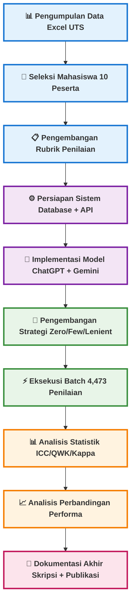

# Diagram Alur Penelitian AES - Implementasi Aktual

## Flowchart Alur Penelitian Multi-Baris



## Detail Implementasi Aktual

### 📊 **Data Preparation**
- **Input**: File Excel `jawaban UTS Capstone Project.xlsx`
- **Mahasiswa**: 16 mahasiswa awal → **10 terpilih** (selected_students.txt)
- **Essays**: **70 esai unik** (10 × 7 pertanyaan)

### 🔧 **System Setup** 
- **Rubrik**: 4 kriteria dengan bobot Content(60%), Organization(20%), Arguments(10%), Language(10%)
- **Scale**: A(4.0), B(3.0), C(2.0), D/E(1.0) + justifikasi detail
- **Database**: SQLite dengan table grading_results + comprehensive logging

### 🤖 **Model Testing**
```
Models & Strategies:
├── ChatGPT-4o
│   ├── Zero-shot: Standard academic prompt
│   ├── Few-shot: 2 contoh penilaian bahasa Indonesia  
│   └── Lenient: "Fokus pada KEKUATAN mahasiswa"
└── Gemini-2.5-Flash
    ├── Zero-shot: Standard academic prompt
    ├── Few-shot: 2 contoh penilaian bahasa Indonesia
    └── Lenient: "Bersikap SUPPORTIF dan POSITIF"
```

### ⚡ **Execution Results**
- **Total Gradings**: **4,473** completed records
- **Success Rate**: **99.7%** (13 API timeouts handled)
- **Duration**: 8 weeks systematic execution
- **Quality**: Comprehensive validation & error handling

### 📈 **Analysis Performed**
- **Reliability**: ICC untuk internal consistency
- **Validity**: QWK comparison vs human gold standard
- **Consistency**: Fleiss κ untuk multi-rater agreement  
- **Performance**: MAE, exact match, correlation analysis

### 📊 **Key Metrics Evaluated**
- **Agreement Analysis**: Cohen's κ, Fleiss κ
- **Classification Performance**: Confusion matrices per model-strategy
- **Cost-Effectiveness**: API costs, processing time, scalability
- **Practical Implications**: Implementation recommendations

### 📖 **Final Outputs**
- **Thesis**: BAB III Metodologi + BAB IV Hasil & Pembahasan
- **Publication**: Journal manuscript Q1-ready
- **Guidelines**: Practical implementation framework untuk institusi