# Diagram Alur Metodologi Penelitian AES

## Flowchart Metodologi Penelitian

```mermaid
flowchart TD
    A[📋 START: Problem Identification<br/>Gap dalam AES berbasis LLM] --> B[📚 Literature Review<br/>AES + LLM + Psychometric Theory]
    
    B --> C[🎯 Research Design<br/>2×3 Factorial Design<br/>2 Models × 3 Strategies]
    
    C --> D[👥 Sampling<br/>Purposive Sampling<br/>10 Students Selected]
    
    D --> E[📝 Instrument Development<br/>4-Criteria Rubric<br/>A/B/C/D/E Scale]
    
    E --> F[🧪 Pilot Testing<br/>System Validation<br/>Rubric Reliability Check]
    
    F --> G{🔍 Pilot Results<br/>Satisfactory?}
    
    G -->|No| H[🔧 Instrument Revision<br/>Rubric Refinement<br/>System Debugging]
    H --> F
    
    G -->|Yes| I[⚙️ Infrastructure Setup<br/>Database Design<br/>API Configuration]
    
    I --> J[🚀 Experiment Execution<br/>Phase 1: ChatGPT<br/>3 Strategies × Multiple Trials]
    
    J --> K[🚀 Experiment Execution<br/>Phase 2: Gemini<br/>3 Strategies × Multiple Trials]
    
    K --> L[📊 Data Collection<br/>Target: ~4,200 Gradings<br/>70 Essays × 6 Conditions]
    
    L --> M[🔍 Data Validation<br/>Quality Check<br/>Missing Data Handling]
    
    M --> N{📈 Data Quality<br/>Acceptable?}
    
    N -->|No| O[🔧 Data Cleaning<br/>Error Correction<br/>Re-run if Needed]
    O --> M
    
    N -->|Yes| P[📈 Statistical Analysis<br/>Descriptive Statistics<br/>Distribution Analysis]
    
    P --> Q[🔢 Reliability Analysis<br/>ICC Calculation<br/>Cronbach's Alpha]
    
    Q --> R[✅ Validity Analysis<br/>QWK vs Gold Standard<br/>Correlation Analysis]
    
    R --> S[🔄 Consistency Analysis<br/>Fleiss' Kappa<br/>Coefficient of Variation]
    
    S --> T[⚖️ Comparative Analysis<br/>Model Comparison<br/>Strategy Comparison]
    
    T --> U[💰 Cost-Effectiveness<br/>API Cost Analysis<br/>Time Efficiency]
    
    U --> V[📖 Results Interpretation<br/>Statistical Significance<br/>Practical Implications]
    
    V --> W[📋 Report Writing<br/>Academic Manuscript<br/>Thesis Documentation]
    
    W --> X[🎯 END: Research Outputs<br/>Thesis + Publication<br/>Practical Guidelines]

    %% Styling
    classDef startEnd fill:#e1f5fe,stroke:#01579b,stroke-width:3px,color:#000
    classDef process fill:#f3e5f5,stroke:#4a148c,stroke-width:2px,color:#000
    classDef decision fill:#fff3e0,stroke:#e65100,stroke-width:2px,color:#000
    classDef analysis fill:#e8f5e8,stroke:#1b5e20,stroke-width:2px,color:#000
    
    class A,X startEnd
    class B,C,D,E,F,H,I,J,K,L,M,O,W process
    class G,N decision
    class P,Q,R,S,T,U,V analysis
```

## Penjelasan Tahapan Metodologi

### 🔄 **Fase Persiapan (Preparation Phase)**
1. **Problem Identification**: Identifikasi gap dalam penelitian AES berbasis LLM
2. **Literature Review**: Comprehensive review teori AES, LLM, dan psychometric
3. **Research Design**: Desain faktorial 2×3 dengan clear hypothesis

### 🛠️ **Fase Pengembangan (Development Phase)**
4. **Sampling**: Purposive sampling untuk 10 mahasiswa representatif
5. **Instrument Development**: Rubrik 4 kriteria dengan skala A/B/C/D/E
6. **Pilot Testing**: Validasi sistem dan reliability check dengan feedback loop

### ⚙️ **Fase Implementasi (Implementation Phase)**
7. **Infrastructure Setup**: Database design, API configuration, environment setup
8. **Experiment Execution**: Systematic execution untuk kedua model LLM
9. **Data Collection**: Target ~4,200 gradings dengan quality monitoring

### 📊 **Fase Analisis (Analysis Phase)**
10. **Data Validation**: Quality assurance dengan missing data handling
11. **Statistical Analysis**: Multi-level analysis dari descriptive hingga inferential
12. **Comparative Analysis**: Model dan strategy comparison dengan effect sizes

### 📖 **Fase Dokumentasi (Documentation Phase)**
13. **Results Interpretation**: Statistical dan practical significance interpretation
14. **Report Writing**: Academic writing dengan publication standards
15. **Research Outputs**: Thesis completion dan dissemination planning

## Kontrol Kualitas dan Validasi

```mermaid
flowchart LR
    A[📝 Data Input] --> B{🔍 Quality Check}
    B -->|Pass| C[✅ Accepted]
    B -->|Fail| D[❌ Rejected]
    D --> E[🔧 Correction]
    E --> A
    
    C --> F[📊 Analysis Ready]
    
    classDef pass fill:#c8e6c9,stroke:#2e7d32,stroke-width:2px
    classDef fail fill:#ffcdd2,stroke:#c62828,stroke-width:2px
    classDef process fill:#e1f5fe,stroke:#1565c0,stroke-width:2px
    
    class C,F pass
    class D fail
    class A,B,E process
```

## Timeline dan Dependencies

