# Diagram Alur Penelitian

## Flowchart Alur Penelitian Aktual

```mermaid
flowchart TD
    A[Identifikasi Masalah Penelitian<br/>Evaluasi Sistem AES berbasis LLM] --> B[Studi Literature Review<br/>AES, LLM, Educational Assessment]
    
    B --> C[Perumusan Masalah dan Tujuan<br/>Research Questions & Hypotheses]
    
    C --> D[Desain Penelitian<br/>Eksperimen Faktorial 2×3<br/>2 Models × 3 Strategies]
    
    D --> E[Pengembangan Instrumen<br/>• Rubrik Penilaian Holistik<br/>• Prompt Templates<br/>• Validation Checklist]
    
    E --> F[Persiapan Sistem dan Data<br/>• Environment Setup Python 3.11<br/>• API Configuration OpenAI & Google<br/>• Database SQLite Design]
    
    F --> G[Pengumpulan Data Esai<br/>• 10 Mahasiswa<br/>• 7 Pertanyaan per mahasiswa<br/>• Proses Anonymization]
    
    G --> H[Pilot Testing<br/>• 15 Essays validation<br/>• System testing<br/>• Protocol refinement]
    
    H --> I[Eksekusi Eksperimen Utama<br/>• ChatGPT-4o: 3 strategies × 10 trials<br/>• Gemini-2.5: 3 strategies × 10 trials<br/>• Total: 4,200 target gradings]
    
    I --> J[Monitoring Real-time & QC<br/>• Error handling & retry logic<br/>• Data validation 0-100<br/>• Progress tracking per condition]
    
    J --> K[Hasil Data Collection<br/>• 4,473 completed gradings<br/>• 99.7% completion rate<br/>• 13 missing data handled]
    
    K --> L[Analisis Data Statistik<br/>• Descriptive Statistics<br/>• Reliability Analysis ICC, α<br/>• Validity Analysis QWK, r<br/>• Consistency Analysis κ, CV]
    
    L --> M[Analisis Lanjutan<br/>• Mixed-Effects ANOVA<br/>• Effect Size Calculation<br/>• Bootstrap Validation<br/>• Cost-Benefit Analysis]
    
    M --> N[Sintesis Hasil<br/>• Key Findings Documentation<br/>• Visualization Creation<br/>• Statistical Interpretation]
    
    N --> O[Pelaporan dan Dokumentasi<br/>• Academic Manuscript 7,959 words<br/>• Supplementary Materials S1-S5<br/>• Code & Data Documentation]
    
    O --> P[OUTPUT FINAL<br/>• Journal Article Q1-ready<br/>• Complete Thesis Document<br/>• Implementation Guidelines]
    
    style A fill:#bbdefb
    style D fill:#c8e6c9
    style I fill:#ffcdd2
    style K fill:#fff3e0
    style N fill:#f3e5f5
    style P fill:#ffebee
```

## Keterangan Tahapan:

**FASE 1: KONSEPTUAL (A-D)**
- Identifikasi masalah → Literature review → Perumusan masalah → Desain penelitian

**FASE 2: PERSIAPAN (E-H)**  
- Pengembangan instrumen → Persiapan sistem → Pengumpulan data → Pilot testing

**FASE 3: PELAKSANAAN (I-K)**
- Eksekusi eksperimen → Monitoring & QC → Hasil data collection

**FASE 4: ANALISIS (L-M)**
- Analisis statistik dasar → Analisis lanjutan

**FASE 5: PELAPORAN (N-P)**
- Sintesis hasil → Dokumentasi → Output final

## Data Implementasi Aktual:

| Tahapan | Target | Hasil Aktual | Status |
|---------|--------|--------------|--------|
| Data Collection | 4,200 gradings | 4,473 gradings | ✅ 106.5% |
| Completion Rate | 95% minimum | 99.7% | ✅ Excellent |
| Students | 10 participants | 10 completed | ✅ 100% |
| Questions | 7 per student | 7 completed | ✅ 100% |
| Models Tested | 2 LLM models | ChatGPT + Gemini | ✅ Complete |
| Strategies | 3 prompting approaches | Zero/Few/Lenient | ✅ Complete |
| Analysis Metrics | Multiple psychometric | ICC, QWK, κ, CV, etc. | ✅ Complete |